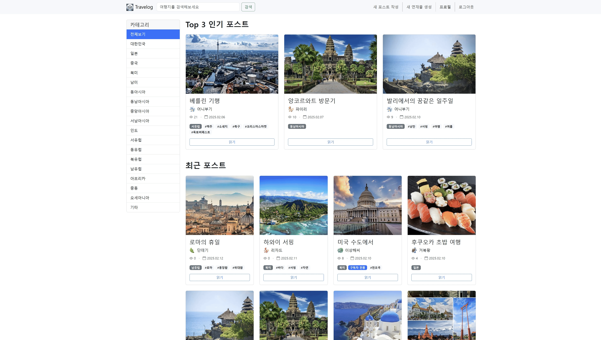
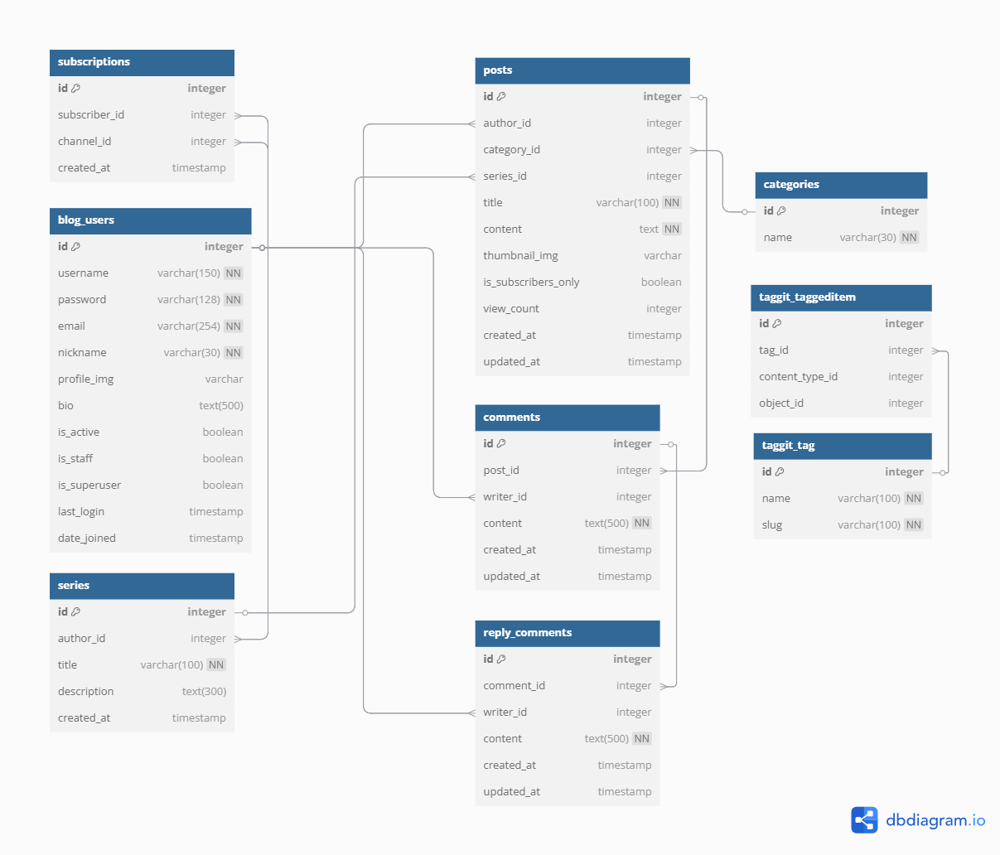

# django-travelog

<p></p>
<h1>Travelog - Django로 만든 여행 블로그</h1>

Django를 활용한 여행 블로그 플랫폼으로, 사용자별 채널과 구독 기능을 통해 여행 포스트를 작성하고 공유할 수 있는 서비스입니다.
글을 작성하고 시리즈로 묶어 연재할 수 있으며, 댓글과 답글로 소통할 수 있습니다.

## 다양한 여행 블로그 feature

1. 사용자/채널 관리

- 회원가입/로그인 (닉네임 = 채널명)
- 비밀번호 변경 기능
- 채널명 변경 가능
- 나의 구독 채널 리스트 조회

2. 포스트(게시글) 관리

- 일반/구독자 전용 포스트 작성
- 포스트 조회수 추적
- 연재물(시리즈) 생성
- 카테고리 분류(여행 지역)
- 댓글 기능
- 대댓글 기능
- 태그 달기 기능
- 검색 기능(제목, 내용, 태그)
- 사이드바 기능(카테고리 조회)

3. 채널 관리

- 나의 구독자 목록 조회
- 인기 포스트 TOP 3 노출(조회수 기준)
- 나의 연재물 목록 표시
- 나의 포스트 목록 표시

## 주요 기능 시연

### 회원가입


### 로그인


### 포스트 조회


### 포스트 생성


### 댓글 달기


### 연재물


### 검색


### 구독, 구독 취소 및 구독자 전용 포스트


### 채널 관리



## 기술 스택

- Backend: Python >= 3.11, Django
- Frontend: Django Template + Bootstrap, TinyMCE(에디터 기능), django-taggit(태그 기능)
- Database: SQLite3(개발), PostgreSQL(상용)

## 설치 방법

1. 저장소 클론

```bash
git clone (저장소 URL)
```

2. 가상환경 생성 및 활성화

```bash
python -m venv venv
source venv/bin/activate  # Windows: venv\Scripts\activate
```

3. 의존성 설치

```bash
개발 환경:
pip install -r requirements/dev.txt

프로덕션 환경:
pip install -r requirements/prod.txt
```

4. 데이터베이스 마이그레이션

```bash
python manage.py migrate
```

5. 개발 서버 실행

```bash
python manage.py runserver
```

## 기여 방법

1. Fork Repository
2. Create feature branch (`git checkout -b feature/amazing-feature`)
3. Commit changes (`git commit -m 'Add some amazing feature'`)
4. Branch push (`git push origin feature/amazing-feature`)
5. Open a Pull Request

## ERD (Entity Relationship Diagram)



## API 명세

### 계정 관련 API

| 메서드 | URL 패턴                   | 기능                | 인증 필요 | Parameter/Body                                                |
| ------ | -------------------------- | ------------------- | --------- | ------------------------------------------------------------- |
| POST   | /accounts/register/        | 회원가입            | No        | 폼: `username`, `password1`, `password2`, `nickname`, `email` |
| POST   | /accounts/login/           | 로그인              | No        | 폼: `username`, `password`                                    |
| POST   | /accounts/logout/          | 로그아웃            | Yes       | -                                                             |
| GET    | /accounts/profile/         | 프로필 조회         | Yes       | -                                                             |
| POST   | /accounts/password/change/ | 비밀번호 변경       | Yes       | 폼: `old_password`, `new_password1`, `new_password2`          |
| POST   | /accounts/nickname/change  | 닉네임(채널명) 변경 | Yes       | 폼: `nickname`                                                |

### 블로그 관련 API

| 메서드 | URL 패턴           | 기능             | 인증 필요 | Parameter/Body                                                                               |
| ------ | ------------------ | ---------------- | --------- | -------------------------------------------------------------------------------------------- |
| GET    | /blog              | 포스트 목록 조회 | No        | Query: `q` (검색어, optional)                                                                |
| GET    | /blog/{pk}/        | 포스트 상세 조회 | No\*      | -                                                                                            |
| POST   | /blog/write/       | 새 포스트 작성   | Yes       | 폼: `title`, `content`, `category`, `series`, `thumbnail_img`, `is_subscribers_only`, `tags` |
| POST   | /blog/edit/{pk}/   | 포스트 수정      | Yes\*\*   | 폼: `title`, `content`, `category`, `series`, `thumbnail_img`, `is_subscribers_only`, `tags` |
| POST   | /blog/delete/{pk}/ | 포스트 삭제      | Yes\*\*   | -                                                                                            |

\* 구독자 전용 포스트는 구독자만 접근 가능
\*\* 작성자만 가능

### 채널 관련 API

| Method | URL Pattern              | Description    | Auth Required | Parameters/Body |
| ------ | ------------------------ | -------------- | ------------- | --------------- |
| GET    | /blog/channel/{nickname} | 특정 채널 조회 | No            | -               |
| POST   | /blog/subscribe/         | 채널 구독      | Yes           | 폼: `nickname`  |
| POST   | /blog/unsubscribe/       | 채널 구독 취소 | Yes           | 폼: `nickname`  |

### 연재물 관련 API

| 메서드 | URL 패턴                  | 기능           | 인증 필요 | Parameter/Body            |
| ------ | ------------------------- | -------------- | --------- | ------------------------- |
| POST   | /blog/series/write/       | 새 연재물 생성 | Yes       | 폼: `name`, `description` |
| POST   | /blog/series/edit/{pk}/   | 연재물 수정    | Yes\*     | 폼: `name`, `description` |
| POST   | /blog/series/delete/{pk}/ | 연재물 삭제    | Yes\*     | -                         |

\* 작성자만 가능

### 댓글 API

| 메서드 | URL 패턴                       | 기능      | 인증 필요 | Parameter/Body |
| ------ | ------------------------------ | --------- | --------- | -------------- |
| POST   | /blog/{post_pk}/comments/write | 댓글 작성 | Yes       | 폼: `content`  |
| POST   | /blog/comments/{pk}/edit       | 댓글 수정 | Yes\*     | 폼: `content`  |
| POST   | /blog/comments/{pk}/delete     | 댓글 삭제 | Yes\*     | -              |

\* 작성자만 가능

### 대댓글 API

| 메서드 | URL 패턴                       | 기능        | 인증 필요 | Parameter/Body |
| ------ | ------------------------------ | ----------- | --------- | -------------- |
| POST   | /blog/comments/{post_pk}/write | 대댓글 작성 | Yes       | 폼: `content`  |
| POST   | /blog/reply/{pk}/edit          | 대댓글 수정 | Yes\*     | 폼: `content`  |
| POST   | /blog/reply/{pk}/delete        | 대댓글 삭제 | Yes\*     | -              |

\* 작성자만 가능

## WBS (Work Breakdown Structure)

- Backend/Frotend를 병행 개발

### Day 1

- [x] 프로젝트 환경 설정
  - Django 프로젝트 셋업
  - 데이터베이스 연결
- [x] 사용자/블로그 모델 설계
- [x] 로그인/회원가입/로그아웃 시스템 구현

### Day 2

- [x] 사용자/블로그 모델 구현
- [x] 포스트 시스템 구현(CRUD)
- [x] 홈 화면 구현
- [x] 메인 화면 구현
  - [x] 모든 포스트 조회 기능
  - [x] 구독자 전용 포스트에 배지 표시
  - [x] 비구독자는 포스트의 읽기 비활성화
  - [x] Top 3 인기 포스트 표시 구현
- [x] 포스트 화면 구현(댓글 제외)
- [x] 채널 화면 구현
  - [x] 시리즈(연재물) 생성 기능
  - [x] 구독 기능 구현

### Day 3

- [x] 조회수 시스템 구현
- [x] 구독자 전용 포스트 구현
- [x] 나의 구독자 조회 기능
- [x] 댓글 시스템 구현(CRUD)

### Day 4

- [x] 카테고리 시스템 구현(고정된 지역 카테고리)
- [x] 대댓글 시스템 구현(CRUD)
- [x] 태그 시스템 구현(CRUD)
- [x] Django Messages 적용
- [x] 포스트 editor 적용
- [x] 포스트 화면 사이드바 적용

### Day 5

- [x] Postgres DB 적용(prod 환경용)
- [x] 문서 보강 및 최종 점검

### 추가 아이템 (추후 작업)

- [ ] AI 서비스 추가
- [ ] 소셜로그인
- [ ] 배포
